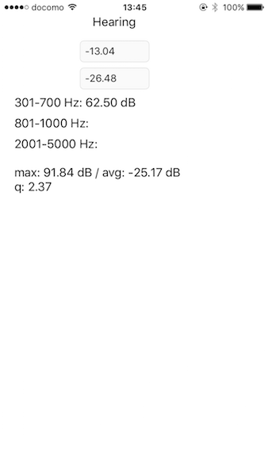

# 乳幼児の泣き声を検知して音を流すアプリのテストバージョン

## 概要

タイトルのままですが、これは乳幼児の泣き声だけを検知して、赤ちゃんが泣き止むような何かしらの音を自動的に流すアプリのソースコードです。iOS がロック中でも動作するので、機種変等で使ってない iPhone などにインストールして赤ちゃんのそばに置いておくといいかもしれません。もしもこのアプリが子育ての一助になったらこれ以上の喜びはありません。

なお、YouTube で赤ちゃんの泣き声を再生しての動作確認はしていますが、何分私は独身なもので現実での動作確認が取れていません。

## 注意事項

このアプリはテストバージョンなので画面はデバッグ用の数値が表示されるものです。画面は皆さんが好きなように改変してください。

## 参考文献

### 乳児の泣き声の周波数分析
    東京電機大学 工学部 情報通信工学科
    横田 秀人,川澄 正史
    http://www.me.sie.dendai.ac.jp/ikuji/resources/6th_yokota.pdf
    日本生体医工学会 http://jsmbe.org

### 乳幼児泣き声の定量的解析と啼泣原因推定
    明大・理 工・情報科学科
    荒川 薫
    https://www.jstage.jst.go.jp/article/essfr/1/2/1_2_2_21/_pdf
    電子情報通信学会 http://www.ieice.org/jpn/

### 音の科学 (朝倉書店)
    著者は図書館のラベルで隠れているので省略します

## ライセンス

MIT

## 作者

tkumata
